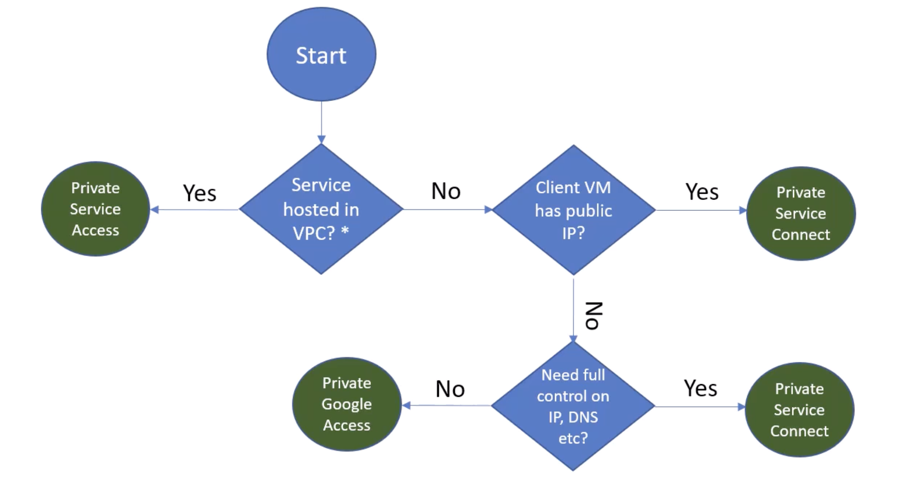
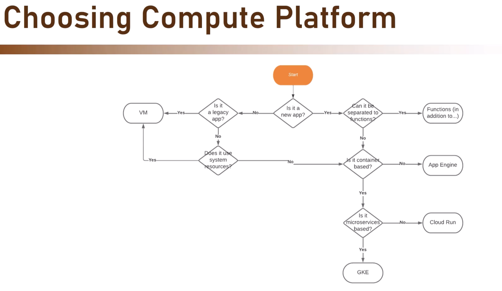
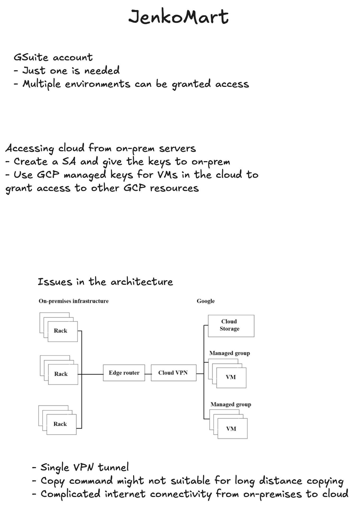
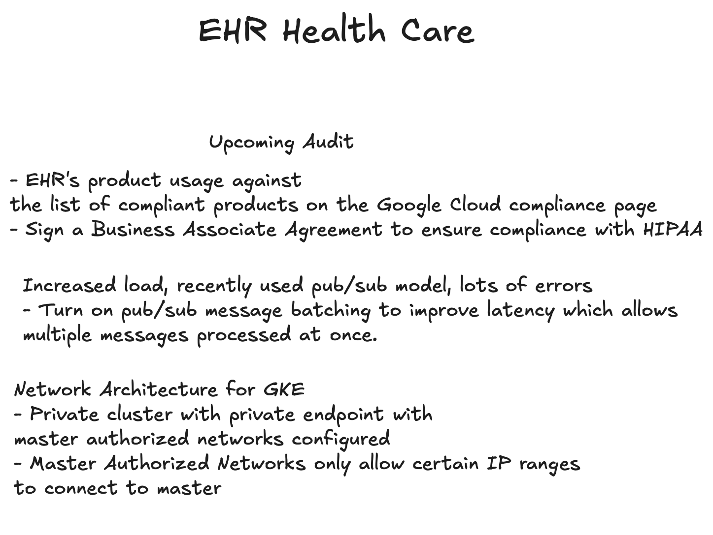

# Google Professional Cloud Architect

https://www.udemy.com/course/google-cloud-platform-from-zero-to-hero-the-complete-guide

Google started their cloud journey with App Engine.

GCP has a different concept of subnets compared to other clouds.

- The frontend and backend isolation with the provate and public subnets is not here from my understanding so far.
- To isolate frontend from backend we need to create a totally new VPC and use firewall rules to restrict traffic.

### Shared VPCs
- VPCs are scoped to a GCP project, inorder to share VPC cross project the Shared VPC concept can be used.
- Host project is the one which shares the vpc to other project
- Service vpc is the one accessing the host project's VPC.

### How to choose a private access Implementation

### Serverless VPC Access
- A non-vpc component needs to access a VPC component, then serverless VPC access is used
- A connector is spun up (basically a VM) which scales and acts as a proxy to our requests.

# Data Storing
1. Structured data
2. Semi-structured data
3. Unstructured data

## Structured data
- Cloud SQL
- Spanner

## Semi-structured data
- Firestore
- BigTable
    - No SQL big data DB

## Unstructured data
- Cloud Storage

[GCP’s CUDs vs SUDs – Comparing Savings on Discounts Pricing](https://blog.economize.cloud/gcp-cud-vs-sud/)

## Committed Use Discounts (GCP CUD) vs Sustained Use Discounts (GCP SUD)

## GCP CUD
- Commitment for long term use (1 or 3 years)

## GCP SUD
- No commitment needed
- Reward for consistently using certain services over a billing month
- The more you use a particular resource within the month, the greater the discount you receive

## Practice test 1

