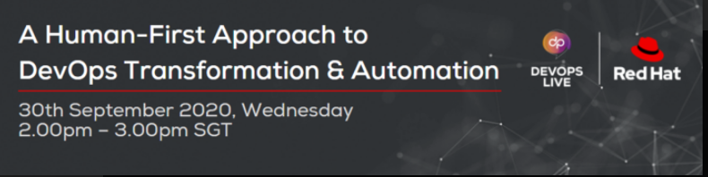
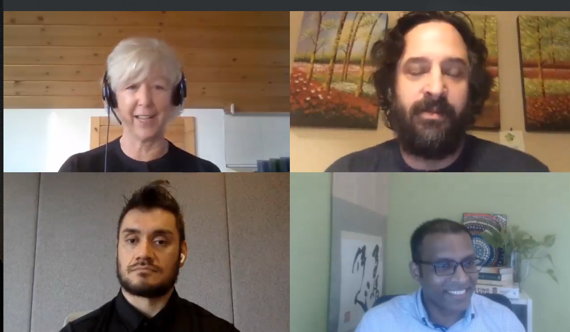

https://www.bigmarker.com/closerstill-media/A-Human-First-Approach-to-DevOps-Transformation-Automation

42% ORG ARE ADOPTING DEVOPS

Cultural aspect - difficulty in devops

No one person can do devops, bringing people together to get a habit.

DevSecOps

## What are some key charactersistics of devops culture

core conflict b/w innovation and effeciency 
agile practices 

reality - operations was difficult, service becomes the business itself and elevates the need.

ability to build whole infra structure from source code

even if it fails, we can recover it fast.

devops- safer, stricter and discipline 

practices are build into the software themselves.

Outside in perspective -
listen and not listen to customer and do what customers want.

Digital transfomation,
https://www.redhat.com/en/solutions/digital-transformation

event driven architecture
speed to market

market is not kind, if you don't do, some other company will do

how do i, as a devops individual, what are my ways to explore **value**, 

human tendency to attach  our identity to our task
    new technologies erase older ones

Make the big picture context understand the devs, to make them provide better value

leadership skill required here

Trust is a key thing in innovation

dealing with velocity, vareity and volume

show the devs the consequence of hsi mistakes by visualising.

**Blackberry analogy**

Show the workers of blackberry, that a person mining cannot contact the outside, if their product is faulty

devops might not work for all cultures. some orgs have diff culture

conway's law

IT Revolution

devops institute

Tools of devops

    learn from internet

Skills for devops 

automation - 2nd highest importatnt skill
Human skills - 1tst most important skill
    empathy, co ordination, not blaming , emotional intelligence, eq, soft skills, learning how to learn, confidence in own abilty, authentic curiosity,

Tech is never stagnant

**a shoe company example**
 
They have a Huge display that shows the number of shoes sold last minute, so every worker there works towards increasing that number.

**expertise is important**

bringing teams together and work towards a single goal

How should I **upskill** myself 

metrics 
    accilerate ?

what's the future

 alwasys an advantage in learning new things

change is not required, survival is mandatory

**no code**

devops vs agile

no diff, devops is an extension of agile

