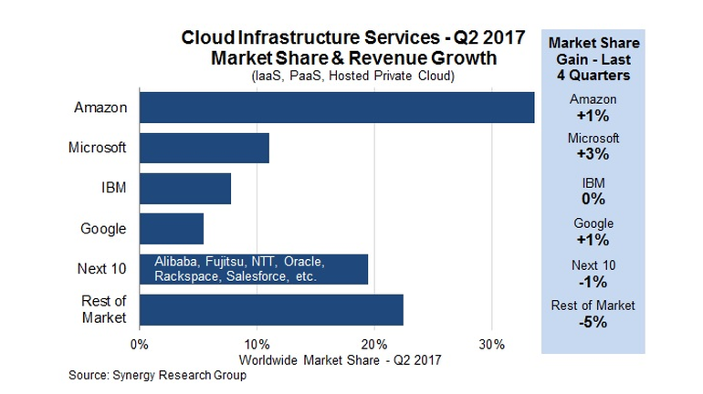
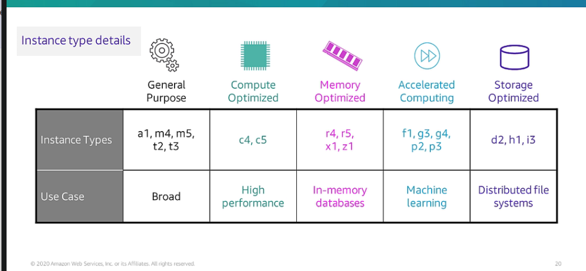
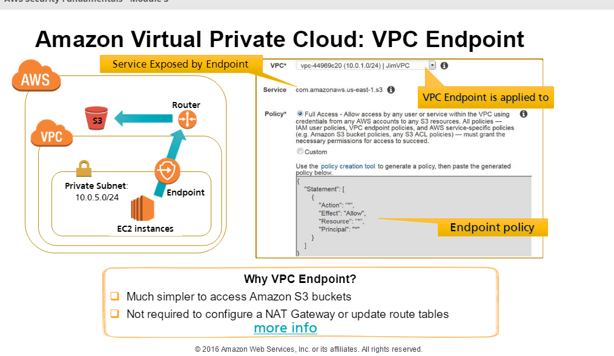
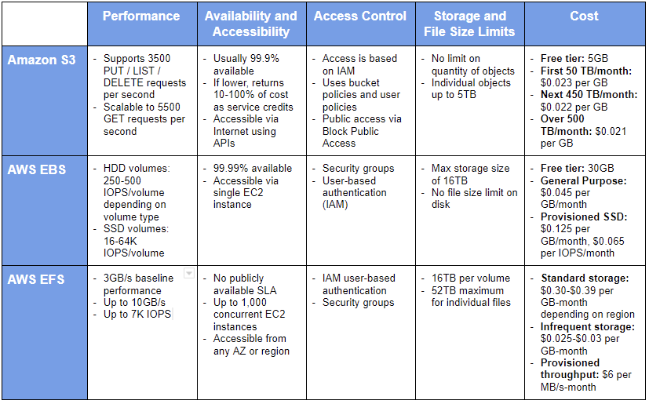
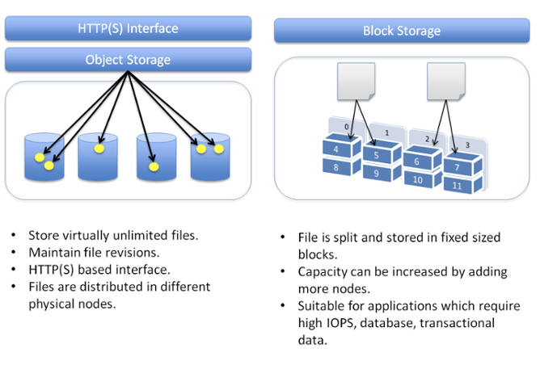
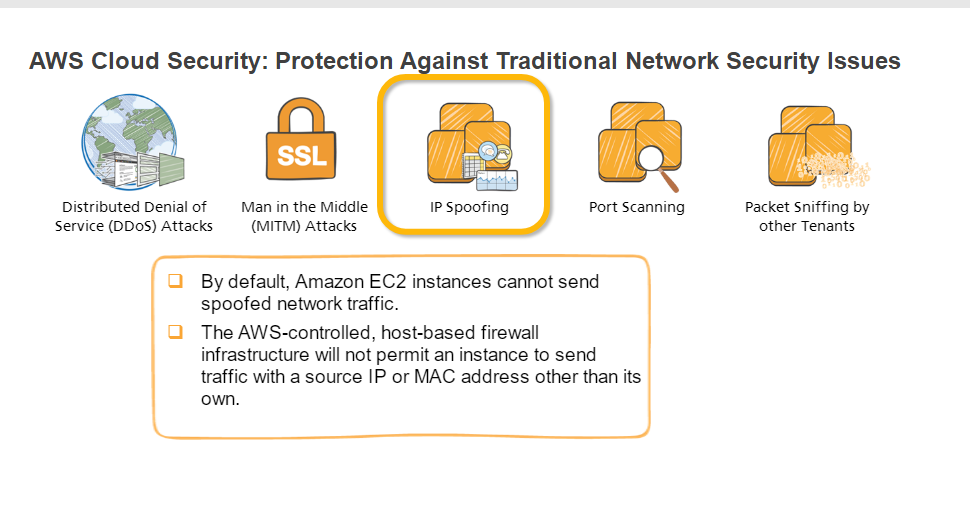
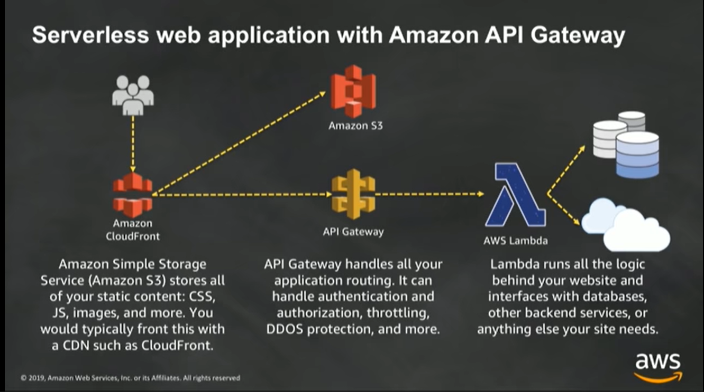

**In aws free tier account beware of NAT Gateway - It's expensive**
**1 GB of EBS per month, Do not create AMI's or save snapshots**
  
[What is Cloud Computing](https://www.zdnet.com/article/what-is-cloud-computing-everything-you-need-to-know-about-the-cloud/)

[aws core services](https://www.aws.training/Details/eLearning?id=29700)

[AWS Networking Fundamentals](https://youtu.be/hiKPPy584Mg)

[Aws docs VPCs and subnets](https://github.com/awsdocs/amazon-vpc-user-guide/blob/master/doc_source/VPC_Subnets.md#vpc-subnet-basics)

[AWS Foundations: Getting Started with the AWS Cloud Essentials](https://www.aws.training/Details/Video?id=49639)

## [VPC](https://docs.aws.amazon.com/vpc/latest/userguide/VPC_Subnets.html)

**subnet is mandatory**

https://youtu.be/rQvl-V3tLiQ

[VPC Demo Edureka](https://youtu.be/UmoxXK_42aU)**

A virtual private cloud (VPC) is a virtual network dedicated to your AWS account. It is logically isolated from other virtual networks in the AWS Cloud

When you create a VPC, you must specify a range of IPv4 addresses for the VPC in the form of a Classless Inter-Domain Routing (CIDR) block; for example, 10.0.0.0/16

Availability Zones are multiple, isolated locations within each Region.

1. An internet gateway enables communication over the internet, and a virtual private network (VPN) connection enables communication with your corporate network.

If a subnet's traffic is routed to an internet gateway, the subnet is known as a public subnet

## [Subnet](https://docs.aws.amazon.com/vpc/latest/userguide/VPC_Subnets.html#vpc-subnet-basics)

Range of IP Adresses in the VPC.

### Aws uses the first 4 and last 1 IP Address in a subnet forr internal purposes. So the subnet count is reduced by 5

If you create a VPC or subnet using a command line tool or the Amazon EC2 API, the CIDR block is automatically modified to its canonical form. For example, if you specify 100.68.0.18/18 for the CIDR block, we create a CIDR block of 100.68.0.0/18

[Tenancy Values]
## Dedicated Instances

Dedicated Instances are Amazon EC2 instances that run in a virtual private cloud (VPC) on hardware that's dedicated to a single customer

## Dedicated Host

A Dedicated Host is also a physical server that's dedicated for your use. With a Dedicated Host, you have visibility and control over how instances are placed on the server.

### [Difference b/w Dedicated Instance and Dedicated Host](https://docs.aws.amazon.com/AWSEC2/latest/UserGuide/dedicated-hosts-overview.html#dedicated-hosts-dedicated-instances)

## Elastic IP Address
 
**public IPv4 address or an Elastic IP address**

An Elastic IP address is a static IPv4 address associated with your AWS account in a specific Region.

## [EBS](https://docs.aws.amazon.com/AWSEC2/latest/UserGuide/AmazonEBS.html)
    
*The volume and instance must be in the same Availability Zone.*

    Elastic Block Store

VPC Endpoint
  - conect within aws (only available with s3 for now) a connection from private instance to an s3 bucket without nat. 

## Load Balancer

[AWS - ALB - Application Load Balancer - Setup & DEMO - Differences from Classic ELB](https://youtu.be/OKnd03nxu3k)

[AWS ELB Tutorial | Elastic Load Balancer Tutorial | AWS Tutorial | AWS Training Video | Simplilearn](https://youtu.be/YO4L_9poF3g)

[What’s The Difference Between Amazon EBS Vs EFS Vs S3?](https://www.missioncloud.com/blog/resource-amazon-ebs-vs-efs-vs-s3-picking-the-best-aws-storage-option-for-your-business#:~:text=The%20main%20differences%20between%20EBS,of%20backups%20or%20user%20files.)

   EBS is only accessible from a single EC2 instance in your particular AWS region 
   
   EFS allows you to mount the file system across multiple regions and instances

## Block Sorage vs Object

[Peer with a VPC in another Account](https://docs.aws.amazon.com/AWSCloudFormation/latest/UserGuide/peer-with-vpc-in-another-account.html)

[Aws Cloud Formation Templates](https://github.com/awslabs/aws-cloudformation-templates/blob/master/community/services/VPC/vpc_template.json)

[AWS CloudFormation VPC template](https://docs.aws.amazon.com/codebuild/latest/userguide/cloudformation-vpc-template.html)

[S3 Buckets](https://docs.aws.amazon.com/AmazonS3/latest/dev/Introduction.html#BasicsBucket)

[Restricting Access to Amazon S3 Content by Using an Origin Access Identity](https://docs.aws.amazon.com/AmazonCloudFront/latest/DeveloperGuide/private-content-restricting-access-to-s3.html#private-content-creating-oai-console)

[Serving private content with signed URLs and signed cookies](https://docs.aws.amazon.com/AmazonCloudFront/latest/DeveloperGuide/PrivateContent.html)

[Gateway VPC endpoints](https://docs.aws.amazon.com/vpc/latest/userguide/vpce-gateway.html)

## Cloud Trails
[What Is AWS CloudTrail?](https://docs.aws.amazon.com/awscloudtrail/latest/userguide/cloudtrail-user-guide.html)

## Elastic Beanstalk

[AWS Elastic Beanstalk Documentation](https://docs.aws.amazon.com/elastic-beanstalk/index.html)

    Platform as a service

Other Paas

[Tutorial: Log the State of an Amazon EC2 Instance Using CloudWatch Events](https://docs.aws.amazon.com/AmazonCloudWatch/latest/events/LogEC2InstanceState.html)

## aws RDS - Relational Database Service

[Amazon Relational Database Service (Amazon RDS)](https://youtu.be/igRfulrrYCo)

## Amazon Aurora

[Amazon AURORA Explained | How does Aurora work? Visual Explanation](https://youtu.be/3DClteE-AUc)

## Aws Security Fundamentals

[AWS Security Fundamentals - Introduction to Cloud Computing and AWS Security](https://www.aws.training/Details/eLearning?id=10796)

Compute Isolation

[Linux AMI virtualization types](https://docs.aws.amazon.com/AWSEC2/latest/UserGuide/virtualization_types.html)

## Aws Dash Services
[Dash Services](https://developer.amazon.com/dash-services)

Best Practices for Public Sector AWS Security Posture

## Securing AWS

[Best Practices for Public Sector AWS Security Posture](https://youtu.be/07V7oId_kLA)

## NACL's Vs Security Group
  - stateless - stateful

[Building APIs with Amazon API Gateway](https://youtu.be/XwfpPEFHKtQ)

[AWS re:Invent 2019: [REPEAT 2] I didn’t know Amazon API Gateway did that (SVS212-R2)](https://youtu.be/yfJZc3sJZ8E)

[What is Amazon API Gateway?](https://docs.aws.amazon.com/apigateway/latest/developerguide/welcome.html)

[Creating a Lambda REQUEST authorizer function](https://docs.aws.amazon.com/apigateway/latest/developerguide/apigateway-websocket-api-lambda-auth.html)

[Building Real Time Applications using WebSocket APIs Supported by Amazon API Gateway](https://youtu.be/3SCdzzD0PdQ)

https://github.com/aws-samples/simple-websockets-chat-app

[What Is AWS Config?](https://docs.aws.amazon.com/config/latest/developerguide/WhatIsConfig.html)

  AWS Config provides a detailed view of the configuration of AWS resources in your AWS account. This includes how the resources are related to one another and how they were configured in the past so that you can see how the configurations and relationships change over time.

