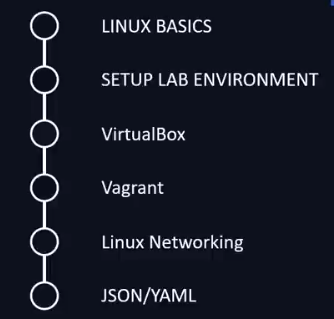
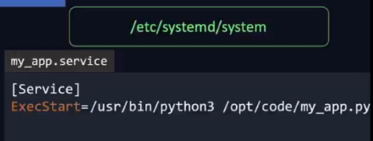

https://youtu.be/Wvf0mBNGjXY

## Linux Basics

Create folder tree in single command
    
`mkdir -p /home/sub1/sub2`

`rm -r /home/sub1/sub2`

`cp -r  <source-folder-tree> <destination>`

`curl <link of the file> -O`

-O to save the file, else it just prints out

`wget <link_to_file> -O "filename"`

Check OS Version

`ls /etc/*release*`

`cat etc/*release*`
 
Cent OS package manager
RPM - RedHat Package Manager

RPM does not install the dependency pakages, it just installs the \<package_name>.rpm file.

YUM is a High Level Package manager that overcomes this problem.

`yum install <package-name>`

yum uses rpm to install packages

repo info is stored at `/etc/yum.repos.d`

`yum repolist`

## Sevices

Run a service even after reboot

systemd file is rquired to achieve this

inside `/etc/systemd/system` folder create a \<servicename>.system file

the file must contain

    [Service]
    ExecStart=\<command to execute after reboot>

    [Install]
    WantedBy=multi-user.target

then run `systemctl daemon-reload` to enable it

finally `systemctl start <service name>`

Example

Docker Service FIle

## VI Editor

`vi filename`

Tools

Source Code Management

    Git 

Build Tool

    Jenkins

Language / Framework

    Java
    Python
    Node.js

Web Server

    Apache
    Tomcat
    Nginx

Databases
    
    MySQL
    MongoDB

Containerization Tools

    Docker
    Kubernetes

Automation Tools

    Ansible
    Chef
    Puppet

Cloud Management Tools

    NoCloudSDk ??

## Connecting to a Remote Machine

Windows - RDP Services

Linux `service sshd status` SSH Service

if ip address is not set, run the following

