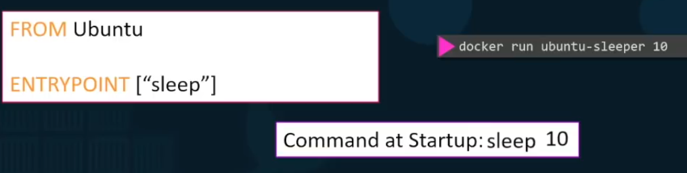

## [Docker](https://docs.docker.com/get-started/)

Docker is a platform for developers and sysadmins to build, run, and share applications with containers

## Container

A container is nothing but a running process, with some added encapsulation features applied to it in order to keep it isolated from the host and from other containers

Each container interacts with its own private filesystem; this filesystem is provided by a Docker image

## Image    

An image includes everything needed to run an application - the code or binary, runtimes, dependencies, and any other filesystem objects required.

**--publish or -p** asks Docker to forward traffic incoming on the host’s port 8000 to the container’s port 8080. Containers have their own private set of ports, so if you want to reach one from the network, you have to forward traffic to it in this way. Otherwise, firewall rules will prevent all network traffic from reaching your container, as a default security posture.

`docker build --tag container-name:version <path-to-docker-file>`

`docker run -p 80:80 -it -d container-name:version`

`docker exec <container_name> <command-to-run>`

Run as root user inside a container

` docker exec -u 0 -it <container_name>  <command>`

**Dockerfile**
## [Docker File Builder](https://docs.docker.com/engine/reference/builder/)
    List of commands to use inside docker build file

`docker tag flaskserver:3.0 salakhaliffjr/flaskserver:3.0`

`docker login`

`docker push salakhaliffjr/flaskserver:3.0`

Entrypoint

To skip port map

`docker run <image> --network=host`

View detailed info 

`docker inspect <container-name>`

## File Storage 

Docker Files location

`/var/lib/docker`

## **Persistence**

`docker volume <volume-name>`

not mandatory, docker automatically createsw volume if none exist

creates a folder in `/var/lib/docker/volumes/<volume-name>` 

`docker run -v <volume-name>:</path/in/container>  container-name:tag`

newer method 

`docker run --mount type=bind,source=/path/in/local/system, target=/path/in/container container-name:tag`

[Docker Mysql](https://dev.mysql.com/doc/refman/8.0/en/docker-mysql-more-topics.html)

## Docker Proxy Issues

    setting proxying in home network where no proxy has been setup  , linux or windows or mac, proxy is same accross everywhere like internet…
    #curl https://registry-1.docker.io/v2/ 336 to see can get respose and setup credentials…
    ubuntu@ubuntuserver:~$ docker pull hello-world
    Using default tag: latest
    Error response from daemon: Get https://registry-1.docker.io/v2/: 137 net/http: request canceled while waiting for connection (Client.Timeout exceeded while awaiting headers)
    ubuntu@ubuntuserver:~$ cat /etc/systemd/system/docker.service.d/http-proxy.conf
    cat: /etc/systemd/system/docker.service.d/http-proxy.conf: No such file or directory
    ubuntu@ubuntuserver:~$ sudo nano /etc/resolv.conf
    #add these lines on top and above one for home router…
    nameserver 8.8.8.8
    nameserver 8.8.4.4
    ubuntu@ubuntuserver:~$ sudo systemctl daemon-reload #THIS IS RESCUE COMMAND…
    ubuntu@ubuntuserver:~$ sudo systemctl restart docker
    ubuntu@ubuntuserver:~$ sudo systemctl status docker
    ubuntu@ubuntuserver:~$ docker pull hello-world
    Using default tag: latest
    latest: Pulling from library/hello-world
    5b0f327be733: Pull complete
    Digest: sha256:07d5f7800dfe37b8c2196c7b1c524c33808ce2e0f74e7aa00e603295ca9a0972
    Status: Downloaded newer image for hello-world:latest
    ubuntu@ubuntuserver:~$ docker run hello-world
    Hello from Docker!
    This message shows that your installation appears to be working correctly.

# Docker Swarm

`docker swarm init`

`dockeer swarm join-token worker`

To list the nodes
`docker node ls`

List containers in nodes
`docker node ps`

`docker stack deploy -c <compose-file> <name>`

List Services
`docker service ls `

`docker stack services ls`

`docker network create -d overlay my-overlay`

`docker stack depluy -c <yml-file> <stack-name>`

## Docker Swarm

[Fault Tolerance](https://docs.docker.com/engine/swarm/admin_guide/#add-manager-nodes-for-fault-tolerance)

`docker network inspect <network-name>`

[Connecting docker container on multiple hosts](https://goldmann.pl/blog/2014/01/21/connecting-docker-containers-on-multiple-hosts/)

[Using Multi-Host and Overlay networking with Docker](https://www.aerospike.com/docs/deploy_guides/docker/networking/)

[ADD Vs COPY](https://stackoverflow.com/questions/24958140/what-is-the-difference-between-the-copy-and-add-commands-in-a-dockerfile)

    ADD can be source link, but COPY can only refer to a local file

[ENTRYPOINT Vs CMD](https://goinbigdata.com/docker-run-vs-cmd-vs-entrypoint/)

    CMD - default command, gets replaced if argument is passed
    ENTRYPOINT - Runs whenever a container is executed

    Eg:
    ENTRYPOINT sleep
    CMD 5

    when running thsi container if 10 is passed as parameter the system sleeps for 10 secs, if no args passed , it sleeps for 5 sec