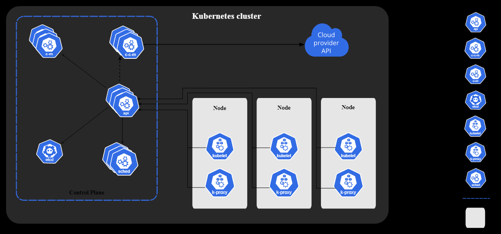

# Kubernetes
*container orchestration - similar to docker swarm*

 - Kubernetes is a portable, extensible, open-source platform for managing containerized workloads and services, that facilitates both declarative configuration and automation. It has a large, rapidly growing ecosystem. Kubernetes services, support, and tools are widely available.

[Kubernetes Tutorial for Beginners](https://youtu.be/X48VuDVv0do)

## [Components](https://kubernetes.io/docs/concepts/overview/components)

Pod
  -  abstraction over a container
  -  In Kubernetes, a Pod represents a set of running containers on your cluster.

## Commands

After Setting up the cluster

Creating a Pod

`kubectl run <pod-name> (nginx-pod) --image=<docker-image-name> (nginx)`  

`kubectl get pods -o wide`

`kubectl describe pod <pod-name>`

Create Components from yaml file

`kubectl create -f file.yml` or `kubectl apply -f filename.yaml`

Generate a base template with kubectl

`kubectl run <pod-name> --image=<image-name> --dry-run=client -o yaml > template.yaml`

Edit a Pod

`kubectl edit pod <pod-name>`

`kubectl replace -f filename.yaml`

## Scale
`kubectl scale --replicas=6 replica-set-file.yml`

`kubectl scale --replicas=6 replicaset[type] myapp-replica[name of replicaset created already]`

`kubectl edit replicaset <replica-set-name>` modify the replicas value.

## Rolling Updates
  -  If there is a cluster of servers, Upgrading all at once cvauses a downtime. Hence roll the updates in batches.

