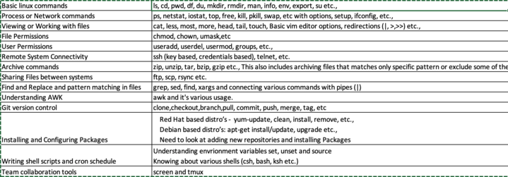

Assignment1: Write a shell script to the following:
1. The script should should install the LAMP stack based on the distro where it is run. 
    For now, the script can support debian and redhat based distro's.
2. There will be commandline options to manage the service stack (Apache2, MySQL and PHP):
        Install the stack: It should install the latest LAMP Stack
        Starting the stack: It should start the db server and web server if they are not up already. 
        If the servers are not present then it should install and start those services
        shutting down the stack: It should stop the web server and  db server
        check the status of the stack: It should show the status of the services running and running versions
3. Prepare and share a sample php application repository into your github repository - MANUAL PROCESS
4. Clone the custom application from your github repo and host in apache2
5. Validate that the site is up with the custom application
6. This script should have a sub script to backup the mysql database directories, archive and backup.
7. The backup script should be added to a cron entry to run every day midnight (UTC) and backup those in /opt/backups directory
NOTE: Make sure to get all the command line options from environment variable, if that ENV variable does not exist then read from the command line options. Also, If both environment variable and command line options are passed then whatever the value passed via command line option takes the precedence

